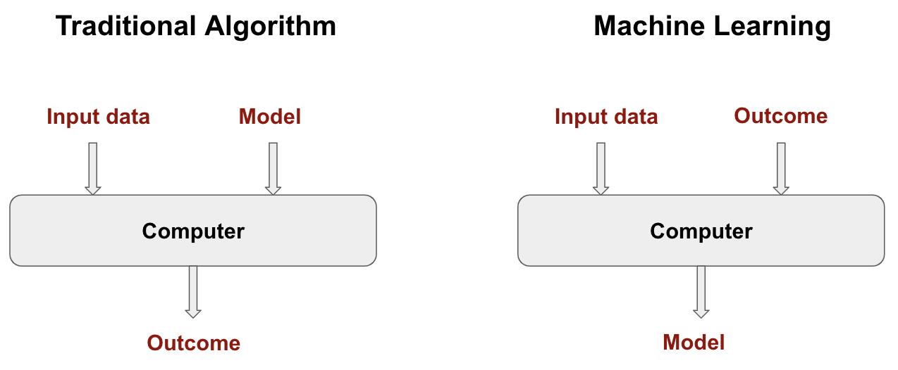

# What is Machine Learning (ML)?

**Short answer: letting the computer learn rules from data.**

In a typical scenario, we have a set of observed data consisting of:

- A set of input data (e.g., satellite image color, measurement time of year, location)
- Outcome measurements (e.g., landcover type)

Using this data, we build a **prediction model**, or **learner**, that is able to predict the outcome for new input data *(note that this typical scenario is only one type of machine learning, called **supervised learning**; machine learning algorithms do not necessarily need outcome measurements, in which case **unsupervised learning** can be used to directly find patterns in the input data. We will talk more about these different types in the following pages)*.

Learning itself is the act of gradually improving performance on a task without being explicitly programmed. This process mimics human neurological functions (e.g., teaching a child to speak): **repetition with more data results in a better learner**.

{:class="img-responsive"}

<i>Figure: Illustration of machine learning. </i>

