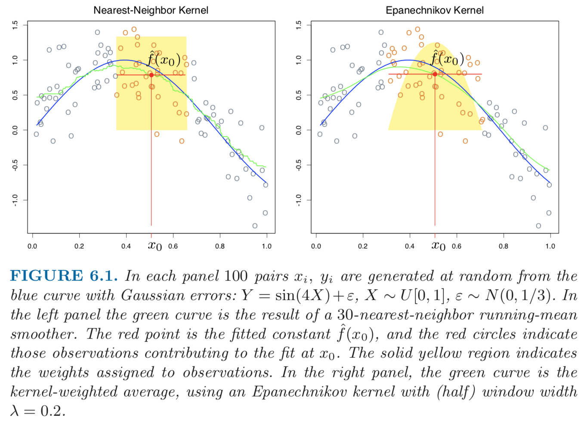
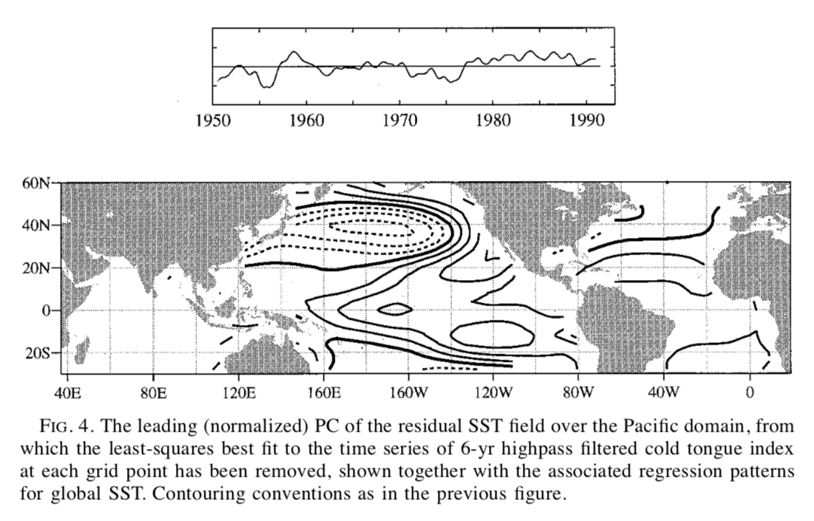

## Linear Regression

#### (Supervised learning, regression)

- Yes, algorithms as simple as linear regression can also be considered as machine learning!

- Simplest regression algorithm with numerous applications

- A good first try for regression problems (it's good idea to start with simple models to understand the data better before building complicated ones!)

- Multivariate linear regression: linear regression with multiple input variables

{:height="40%" width="40%"}

<i>Figure: Illustration of linear regression (image source: https://machinelearning-blog.com/2018/01/24/linear-regression).</i>

{:class="img-responsive"}

<i>Figure: Multivariate linear regression (image source: StackExchange).</i>

## Kernel Smoother

#### (Supervised learning, regression)

- Instead of fitting global data, kernel smoothers only use those input data points close to the new data point <i>x0</i> and fit a simple model on these "local" input data points. Weights can be assigned to these local data points.

- Requires little or no training; just need to wait for the target data point <i>x0</i>, fit a local model and predict on <i>x0</i>.

{:class="img-responsive"}

<i>(image source: Hastie et al. (2016): The Elements of Statistical Learning, Second Edition, Chapter 6.</i>

## Support Vector Machine (SVM)

#### (Supervised learning, classification)

- SVM is a classification algorithm that separates classes with a clear gap that is as wide as possible (i.e., **large margin**).

- SVM is often combined with some data transformations (called **kernels**) such that the transformed data can be linear separated.

- A review of SVM applications in water resources research: [Raghavendra and Deka (2014): Support vector machine applications in the field of hydrology: A review, Applied Soft Computing.](https://www.sciencedirect.com/science/article/pii/S1568494614000611#!)

{:class="img-responsive"}

{:class="img-responsive"}

<i>Figure: Illustration of SVM finding the largest margin decision boundary (upper panel: many possible decision boundaries to separate the data of two classes; lower panel: the decision boundary found by SVM that has the largest margin, i.e., the distance between the decision boundary and the points that are closest to it).</i>

## Decision Tree and Random Forest

#### (Supervised learning, classification or regression)

- A decision tree is similar as a decision making flowchart

- A decision tree can be *learned* from data by greedily choosing the input variable and finding the spliting point that best classifies the training data, repeating this process for each branch. 

- The result of a learned decision tree is intuitive to interpret.

- A **random forest** is a large collective of trees.

    - It aggregates a large number of decision trees trained on a random subset of input data.

    - Can potentially result in better performance.

{:class="img-responsive"}

<i>Figure: Illustration of a decision flowchart (image source: https://imgs.xkcd.com/comics/solar_panels.png).</i>

## K-Means Clustering

#### (Unsupervised learning)

- Clustering methods cluster a dataset into multiple groups.

- K-Means is one of the most commonly used clustering algorithm that iteratively updates the cluster centroids and cluster assignment for each data point. The number of clusters needs to be specified.

{:class="img-responsive"}

<i> Illustration of clustering (image source: https://mubaris.com/posts/kmeans-clustering). </i>

## Principal Component Analysis (PCA)

#### (Unsupervised learning)

- PCA is a statistical procedure that transforms a set of input data of possibly correlated variables into a set of new variables that are linearly uncorrelated (the transformed variables are called **principal components**). After the transformation, the first principle component accounts for as much of the variability in the data as possible, and the second principle component accounts for the largest variability in the remaining dimensions of the data that are orthogonal to (i.e., have no linear correlation with) the first principle component, and so on so forth (source: [Wikipedia](https://en.wikipedia.org/wiki/Principal_component_analysis)).

- PCA can be used for dimention reduction (e.g., image compression)

- PCA is widely used in atmospheric sciences, often referred to as **Empirical Orthogonal Function (EOF)** analysis in the field. For example, EOF can be applied on a temporal-spatial climate dataset to find the most dominant spatial and its associated temporal variation.

{:height="40%" width="40%"}

<i>Figure: For a input dataset with two variables, the PCA algorithm finds the first principal component that accounts for the largest data variability (the longer vector in the figure) and the second principal component that is orthogonal to the first one (the shorter vector in the figure) (image source: https://en.wikipedia.org/wiki/Principal_component_analysis)</i>.

{:class="img-responsive"}

<i>Figure: Example PCA application in atmospheric sciences. Here "residual SST field" is sea surface temperature from which the variability associated with the ENSO cycle has been removed (image source: Zhang et al. (2017): ENSO-like Interdecadal Variability: 1900–93, Journal of Climage).</i>

## Neural Network

#### (Supervised or unsupervised learning, classification or regression)

- Neural network is framework for many algorithms, vaguely inspired by the structure of animal brains.

- A typical neural network has an input layer, one or multiple hidden layers, and an output layer. Each layer consists of a collection of units or nodes (called **neuron**) that are connected with those neurons in the adjacent layers via transformations (called **activation functions** with parameters).

- A hidden layer can "learn" a set of new variables from the previous layer, which would be a better set of input variables for the next layer.

- Machine learning using neural networks with many hidden layers are sometimes called **deep learning**.

- There exist a large number of various constructions of neural networks, suitable for different applications.

- A good review of neural network/deep learning applications in water resources research: [Shen (2018): A transdisciplinary review of deep learning research and its relevance for water resources scientists, Water Resources Researh.](https://agupubs.onlinelibrary.wiley.com/doi/full/10.1029/2018WR022643)

{:class="img-responsive"}

<i>Figure: Illustration of a neural network with two hidden layers (image source: https://www.digitaltrends.com/cool-tech/what-is-an-artificial-neural-network).</i>

